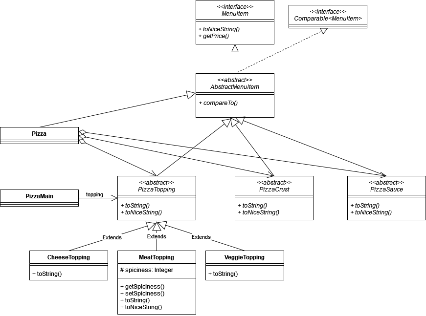

## Programming Assignment 2 starter code 

This starter project mainly consists of the instructor solution to Exercise 7. Feel free to use it or use your own Exercise 7 as a starting point.

The following UML class diagram shows the corresponding structure of this code:

(For readability, subclasses of PizzaCrust, PizzaSauce, and the indirect subclasses of PizzaTopping are not shown.)
